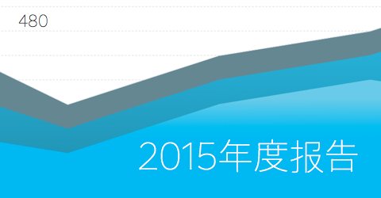
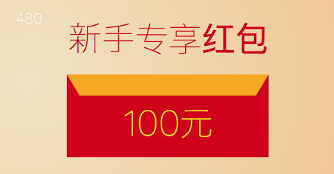

# response

1. 响应式优缺点
* 优点: 节省时间，减少工作量,每个设备都得到正确的设计,搜索优化...
* 缺点: 加载更多的样式和脚本资源，设计较难的的精确控制，老版本兼容性不好...
2. 媒体查询
* 查询符 not、and、or、only
  * not: 有效范围到","
  * and: 全部符合
  * or: 符合其中一个，等同","
  * only: 防止老旧的浏览器，不支持带媒体属性的查询
3. 设置viewport视口
* <meta view="viewport" content="width=device-width,initial-scale=1.0,maximum-scale=1.0,minimum-scale=1.0,user-scalable=no" />
4. 响应式网站设计实践原则
* 渐进增强
* 优雅降级
5. Css Resets
* 每个浏览器特定标签的解释都有差异
* reset.css: 重置浏览器的css默认样式，浏览器的品种不同样式不同，然后重置，让他们统一
* normalize.css: 保留有用的浏览器默认样式，而不是一概的将它们抹杀，normalize.css作用在范围更广的元素上面，修正了一些bug及主流浏览器在渲染上的不一致
6. 三个单位px,em,rem
* px
  * 1px相当于1像素
* em
  * 参照物为父元素的font-size
  * em具有继承的特点
  * 没有参照物时，浏览器会默认设置: 1em = 16px;
* rem
  * 参照物为 根元素html，固定不变
  * 没有设置font-size时，默认设置: 1rem = 16px;
  * html{font-size: 62.5%;} 1rem = 62.5%^16px=10px
7. 隐藏内容
* display: none; 不会 占用;
* visibility: hidden; 空间还在不会压缩;
8.清除浮动
* clear: both;
* overflow: auto/hidden;
* 父元素也浮动(不推荐);
* .clearfix:after{c,c,d,h,o,v}
  * content=".";clear:both;display:block;height: 0;overflow: hidden;visibility: hidden;
  * .clearfix{ zoom: 1 } 兼容IE6,7
* .clearfix:after,clearfix:before{ content="";display: table;} .clearfix: after{clear: both;} before可以避免上下margin重合
* bfc: display: inline-block/table-cell/table-caption; overflow: 除了visibility;position: absolute/fixed;
9. 媒体查询
* @media only screen and (max-width:30em;) 1em = 1rem = 16px; @media级别不在html之下
10. li + li 除了第一个li
11. 响应式广告
* owl.carousel
  * 引用
  ···
  <link rel="stylesheet" href="js/vendor/owl.carousel.2.1.0/assets/owl.carousel.min.css">
	 <link rel="stylesheet" href="js/vendor/owl.carousel.2.1.0/assets/owl.theme.default.min.css">
  
	 
  
  
  ···
  ···
  main.js
  $(document).ready(function () {
    $(".owl-carousel").owlCarousel({
        items: 1,
        loop: true,
        autoplay: true,
        autoplayTimeout: 3000,
        autoplayHoverPause: true
    });
  });
  ···
  ···
  html
  

			

				

					<picture>
					    <source srcset="img/ad001-l.png" media = "(min-width:50em)">
					    <source srcset="img/ad001-m.png" media = "(min-width:30em)">
					    
					</picture>
				

				

					<picture>
					    <source srcset="img/ad002-l.png" media = "(min-width:50em)">
					    <source srcset="img/ad002-m.png" media = "(min-width:30em)">
					    
					</picture>
				

				

					<picture>
					    <source srcset="img/ad003-l.png" media = "(min-width:50em)">
					    <source srcset="img/ad003-m.png" media = "(min-width:30em)">
					    
					</picture>
				

			

		

  ···
